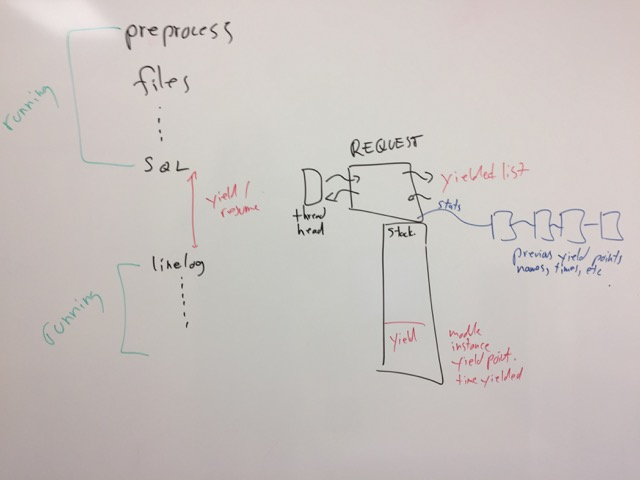

# Scheduler

Each worker thread runs a scheduler.  Which does the following:

* check the resumable queue for "too old" packets.
* * once per second, and then check check all packets older than 1s.
* * ideally printing out where the request is blocked (module, instance, name)
* * See yield / resume, below
* service the event list
* * FD events first
* * followed by timer events
* * so that we read packets from sockets before they time out...
* service the incoming queue from network threads
* * add packets to the "decode" list, which is run at a higher priority than other requests.
* * the idea here is to quickly clean up the messages between network threads and worker threads
* * push decoded packets onto the "runnable" priority heap, which is ordered by time.
* grab a request from the "runnable" heap.
* check `fr_status_continue()`
* * if socket is closed, drop the request
* * if conflicting packet has come in, drop the request
* * process the packet until it's done, or until it yields
* keep looping

## Signaling

See the [pipe](pipe) page for more details. And [signal](signal) page.

The main problem we have with network / worker threads is signaling.
If the packets are widely spaced, the network thread can signal the
worker thread for every packet, and vice-versa for every reply.
However, if the packets arrive quickly, each end should switch to
busy-polling.

How to do this is non-trivial.

## Statistics

We need delay statistics for slow modules (Hi, SQL!).  The best
solution is the following.

Times are recorded on `unlang_yield()` and `unlang_resume()`.  The
delta is the time spent waiting on events for the module to do
something.  In addition, we need to track the module name, the
instance name, and a name of this yield point (e.g. user lookup,
versus group lookup).

We do this via dictionary attributes.  Which there is no *requirement*
to do so, doing it this way enables policies to be based on these
times, and allows for simple tracking / stats.

We create a new list `stats` for each request.  This is a list of
statistics attributes that is (ideally) read-only.  Only the server
core can write to it.

The `modules.c` code then creates a series of TLVs, all under one
parent TLV.  8 bit sub-TLVs should be good enough here.

  Module-Statistics
    Module-Stats-SQL
      Module-Stats-SQL-SQL1
        Module-Stats-SQL-SQL1-operation1
          Module-Stats-SQL-SQL1-operation1-Delay
          Module-Stats-SQL-SQL1-operation1-Total-Requests
          Module-Stats-SQL-SQL1-operation1-Delay-1us
          Module-Stats-SQL-SQL1-operation1-Delay-10us
          Module-Stats-SQL-SQL1-operation1-Delay-100us
          Module-Stats-SQL-SQL1-operation1-Delay-1ms
          Module-Stats-SQL-SQL1-operation1-Delay-10ms
          Module-Stats-SQL-SQL1-operation1-Delay-100ms
          Module-Stats-SQL-SQL1-operation1-Delay-1s
          Module-Stats-SQL-SQL1-operation1-Delay-10s
          Module-Stats-SQL-SQL1-operation1-Delay-100s

All are TLVs, except for the lowest layer, which are `integer64`.

The `modules.c` code creates the first few layers of each TLV.

The `modules` header file defines a few macros:

  DEFINE_YIELD_POINT(name)
  USE_YEILD_POINT(inst, name)
  CACHE_DA_YIELD_POINT(name)
  CREATE_DA_YIELD_POINT(inst, name)

Which (in turn):

* defines a named yeild point, and updates various other internal macros to be used by `CACHE_DA` and `CREATE_DA`

* uses the pre-defined `da` inside of an `unlang_yield()` call.  The
  `da` should be cached inside of the module instance struct, so that
  we don't have to do dictionary lookups at run time.

* creates a `fr_dict_attr_t const *da_yeild_point_NAME;` inside of the module instance structure.

* in the module `bootstrap()` function, creates all of the relevant
  `da`s and caches them in the module instance.

We should then also have a `module_stats` module, which looks at the
per-request stats, and auto-creates the bins for each yeild point.
And probably also aggregates the stats up the TLV tree.

Then, once per 1K requests, or every second (whatever is shorter),
grabs a mutex lock, and aggregates the binned data to global counters.

That way the stats API can just query that module, and the module
returns total stats for all delays in the server.

## Yield / Resume

The thread needs to know which requests are yielded, so it can issue
warnings about blocked modules.  The best way here is for the
`REQUEST` to have a pointer to thread-specific data (yielded linked
list), and adds itself to the tail of the list.  When the request
resumes, it removes itself from the list.

In the current code, when a request is waiting for a timeout or a
socket event, the request is "lost", and buried inside of the event
loop.  The thread has no way of knowing where the request is.

With this solution, the thread has a linked list (oldest to newest) of
yielded requests.

This design goes along with the philosophy of the rest of the server
of "track as little as possible, and do work asynchronously where
possible".

