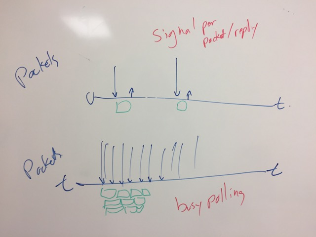

# Signalling

We need an efficient way to send information between threads.  Version
2/3 has a single network thread, and multiple worker threads.  They
all share one incoming packet queue.  The network thread writes to the
queue.  The worker threads read from it.  This is done via a semaphore
and a mutex.

The worker threads are synchronous, so they process a request start to
finish, and then do a blocking wait on the mutex.  Analysis shows that
the mutex is highly contended, and under load, the network thread is
busy while the worker threads are largely idle.

A partial solution is the [message](message) and [pipe](pipe)
subsystems.  They allows for zero-copy messages, which are sent via
single-producer-single-consumer (SPSC) thread-safe atomic queues.

The problem is signalling remains, however.

## Boundary conditions

We have two boundary conditions, where we want to be efficient:

* low volume: inter-packet spacing is much larger than packet processing time

* high volume: inter-packet spacing is smaller than packet processing time.

In the first case, one worker thread is sufficient.  In the second
case, we have multiple worker threads per network thread.

The diagram below shows this.

Each boundary condition is simple to manage in and of itself.  In the
low volume case, we just signal every packet and every reply.  In the
high volume case, the threads just busy-poll the queues, (in between
processing other requests), because there will always be new packets
in the queues.

We want to know when to transition from one state to another.  We also
want to integrate this signaling into the threads event loop.

## Event loop integration

So first just to explain the background behind the thinking.

The issue with using these atomic queues over unix
sockets/pipes/socket pairs is that they cannot be integrated into a
thread's (either worker or network) event loop directly, because
there's no FD for an event loop to report readable/writable states
for.

A thread's event loop is used for two things:

* Waiting on sockets (read / write availability).
* Wait for a timer event which needs servicing.

When nothing is to be done, the thread blocks, waiting on the event
loop.

The event loop is *not* used to directly process the atomic queues, though
it may be used to communicate information about their states.

If we do a busy loop over all the queues checking for new packets, and
by calling kevent to check for I/O events, we use lots of CPU time, so
the thread must sleep when there's nothing to do.

If the thread is sleeping, the question is, how do we wake it up when
there are packets to be read from queues.

The super stupid/simple approach is just to use a timer and wake up
every N ms, then check all the queues for new packets. But this wastes
CPU time, and we have select() like, O(n) performance issues with
large numbers of queues.

We could have each producer signal the consumer whenever it puts new
packets in its queue, but now we have massive overhead from all those
signals (whichever form they're in), and we still have select() like,
O(n) performance issues with large numbers of queues.

So it seems like the requirements for this to be efficient are:

* A signalling path for the producer to inform the consumer there are
  new packets.

* A signalling path for the consumer to inform the producer it's not
  going to check for new packets unless it's told explicitly that
  there are some outstanding.

* The above need to be scoped in terms of queues, i.e. "the not
  checking unless signalled state" needs to be communicated on a
  per-queue basis.

This allows the producer/consumer to maintain a set of "active"
queues, where the consumer does not need to be signalled, because it's
doing whatever fancy busy wait/dequeuing behaviour it needs to, and a
set of "inactive" queues, where, if there's a new packet, the consumer
needs to be informed explicitly.

The most obvious solution for this seems to be using kevent() for
signalling, because it's relatively fast, and it's there... and it can
be swapped out easily for unix sockets or pipes if we ever move to a
split process model.

But using kevent introduces synchronisation problems.

The specific scenario we were considering was where the consumer,
signals the producer (via kevent) that it's going to stop servicing
the queue, and there's a delay between that signal being sent, and it
being acted on by the producer, and in that time the producer enqueues
more packets.

We discussed two ways of fixing this.

* The first was - Have the producer ACK (with another signal, or packet in the queue)
  that it received the notification.  When this was received by the
  consumer, the consumer could then stop servicing the thread.

* The second was - Write sequence numbers into the message structures.  When the
  consumer sends the kevent saying its going to stop servicing the
  queue, it includes the last sequence number it processed.  When the
  producer processes the consumer's kevent, it checks the sequence
  number, `if (signal.seq_number < last_wrote_to_queue.seq_number) send_kevent_to_consumer()`

The advantages of the second method are fewer signals, and the
consumer can stop servicing the kqueue immediately, instead of having
to wait for an acknowledgement from the producer.

Because the second method appears to be the best method, we started 
considering what other useful things could we do with the sequence numbers.

One advantage is that if we have a second type of kevent, which is
just used to inform the originator of the consumers progress, we can
work out the number of outstanding packets in the queue, and use that
for levelling information.  I don't think ACKing every packet is
sensible, but periodic ACKs to indicate progress could be useful.

Another advantage of sequence numbers is it gives us an identifier for
debugging to track the packet as it progresses through the server.

Those advantages are secondary though, even if we find better methods
of load levelling and tracking packets, we'd still need sequence
numbers unless there's a better way of doing this producer/consumer
signalling and maintaining active/inactive sets of queues.

## Transitioning

The transition from one boundary condition to the other is done by the
network thread tracking inter-packet spacing, and the worker thread
tracking total CPU time spent processing requests.  Note that this is
*not* time spent tracking requests from a particular source.  It's
tracking *all* requests.

We should have thread affinity.  This is where a network thread
preferantially sends packets to one worker thread, until that worker
thread is busy.  It then starts sending some packets to other worker
threads.  But it still tries to keep the original worker thread busy.

If the network thread isn't communicating with a worker thread, it
generally has no idea how busy that thread is.  So we may need another
way to order threads.  It's probably best for a network thread to only
know about the worker threads it's using.  And to not even know if
other threads exist.

Each reply from a worker thread contains it's view of how much CPU
time it has spent.  (So far?  Or in the last second?)  Ideally, it
also includes the time spent to process this request.  Which lets the
network thread predict the average time per request.  Perhaps the
exponential moving average (EMA) is the best way to track / predict
this.  Every new packet coming in gets an estimate of CPU time to
process it, based on the EMA.

If there are packets outstanding, the network thread can assume that
the worker thread has been busy since the last packet sent to the
worker thread.  This estimation is pessimistic, as the worker thread
may, in fact, be idle, and waiting for an event to continue processing
the request.  This is a simple assumption.

The more complex assumption is predict the CPU time for the worker
thread.  This is done by taking the time we last received a reply from
it, and adding to that time the total predicted CPU time for
outstanding packets.  We then use that predicted number to choose a
worker thread.
