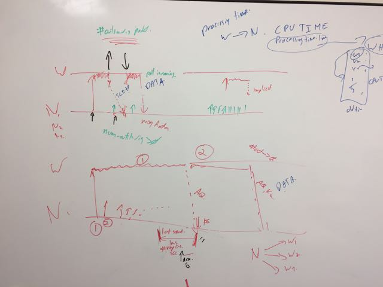
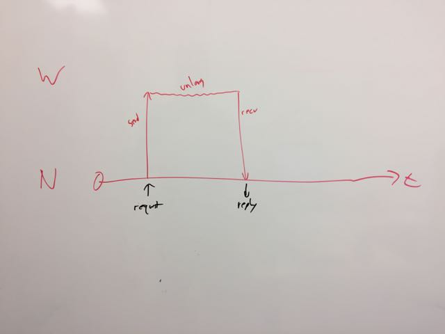
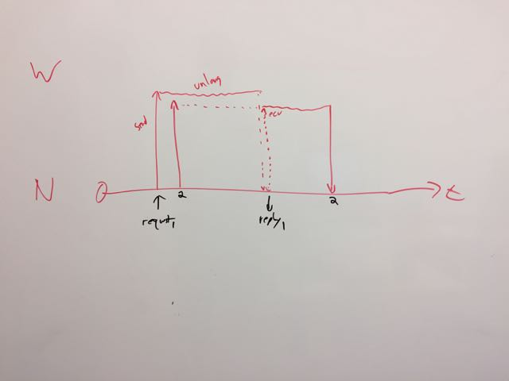
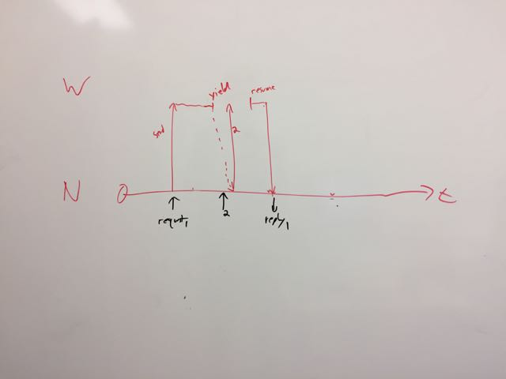

# Signaling

We need an efficient way to send information between threads.  Version
2/3 has a single network thread, and multiple worker threads.  They
all share one incoming packet queue.  The network thread writes to the
queue.  The worker threads read from it.  This is done via a semaphore
and a mutex.

The worker threads are synchronous, so they process a request start to
finish, and then do a blocking wait on the mutex.  Analysis shows that
the mutex is highly contended, and under load, the network thread is
busy while the worker threads are largely idle.

A partial solution is the [message](message) and [channel](channel)
subsystems.  They allows for zero-copy messages, which are sent via
single-producer-single-consumer (SPSC) thread-safe atomic queues.

The problem is signalling remains, however.

## Boundary conditions

We have two boundary conditions, where we want to be efficient:

* low volume: inter-packet spacing is much larger than packet processing time

* high volume: inter-packet spacing is smaller than packet processing time.

In the first case, one worker thread is sufficient.  In the second
case, we have multiple worker threads per network thread.

The diagram below shows this.

Each boundary condition is simple to manage in and of itself.  In the
low volume case, we just signal every packet and every reply.  In the
high volume case, the threads just busy-poll the channel, (in between
processing other requests), because there will always be new packets
in the channel.

We want to know when to transition from one state to another.  We also
want to integrate this signaling into the threads event loop.

# Design

_Please see this files history for older designs.  They were discarded
because they mostly worked, but had critical details unresolved._

After much discussion, the design issues with older ideas were
resolved through applying two key concepts:

1. Self-clocking, where we can rely on new events to help us service ongoing events

2. Tracking the number of outstanding requests, and paying attention to the zero/non-zero transitions.

The explanation is that if there are events being processed, a thread
is active, and will (at some point) get to servicing a channel.
Critically, a thread always services *both* channels.  That is, when
it's sending data, it also checks the receive side of the channel.
Secondly, only the transitions 0 -> 1 and 1 -> 0 need to be explicitly
signaled.  Almost all other signals can be suppressed, by relying on
polling the receive side when writing to the send side.  The following
diagrams shows the full design.  Subsequent diagrams will walk through
the design in more detail.

## Network to Worker Signaling

This section describes the design of the network to worker signaling.
The result of the design is that the system automatically transitions
between signaling and busy polling, based on simple rules.

### The one packet approach

In the low-volume / simple scenario, we only have one packet being
processed at a time.  The server starts in a steady state where all
threads are idle and waitinf for events.  The packet is received,
processed, and replied to.  The server then returns to the idle state.

In this diagram, time goes from left to right.  'N' is the network
thread.  'W' is the worker thread.  We omit the time line for the
worker thread, in order to highlight the fact that's it's busy only
part of the time.  The black arrows are incoming / outgoing packets.
The red arrows are signals between the threads.

When it recieves a packet, the network thread sees that there are no
outstanding packets to the worker thread.  i.e. it believes that the
worker thread is idle.  It therefore has to signal the worker thread
that a new packet is ready.

The worker thread receives the signal, processes the packet, and sends
the reply.  On sending the reply, it notices that it now has no more
work to do, so it must signal the network thread.

This process works for the simple scenario.  We now see what happens
when two packets arrive, one shortly after the other.

### Overlapping Requests

In this scenario, the network thread receives a second packet while
the worker thread is processing the first one.  The diagram below
shows this in more detail.

When the network thread receives the second packet, it notices that
the worker thread is busy.  The network thread does not signal the
worker thread.  There is no point in such a signal, as the worker
thread is busy doing other work.  We can rely on the fact that when
the worker is finished other work, it will service it's receive channel.

We can see that when request 1 is done, the worker thread sees that
there is an additional request to service.  It picks up the request
_without being signaled_, and runs it.  This process con continue for
multiple overlapping requests.

For now, we ignore the problem of the worker thread signaling the
network thread.  We just wave our hands and assume it works.

We can see, therefore, that our earlier assumptions simplify the
design enormously.  The self-clocking mechanism ensures that the
network thread knows the worker thread will be servicing the channels.
Tracking the number of outstanding requests ensures that each end
knows when the other end requires signals, or is busy-polling.

### Yield / Resume

The above scenario requires modification for yield / resume.  In this
scenario, the worker thread is idle, while the network thread believes
that the worker is processing a request.  There is a race condition
possible where the worker goes to sleep, at the same time the network
thread sends it a new packet *without* an explicit signal.  We then
have a situation where the worker waits for a long period of time
without servicing it's input channel.

The solution is that when the worker is about to sleep, it sends a
signal to the network thread.  This signal contains the sequence
number of the last packet the worker read from it's receive channel.
When the network thread receives this signal, it checks it's idea of
the channel.  If the sequence numbers match, there is nothing else to
do.  If, however, the sequence number from the signal is lower than
the sequence number from the channel, the network thread sends a "data
ready" signal to the worker.

This signal wakes up the worker, and informs it that the channels have
to be serviced.

